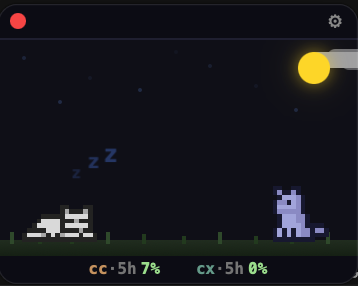
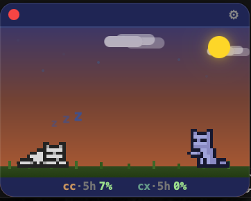
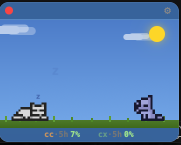
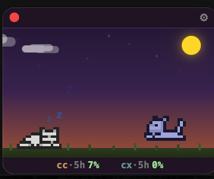
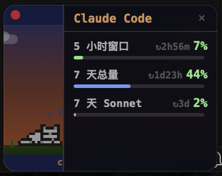
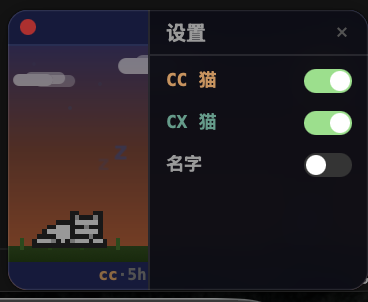

中文 | [English](README.md)

# c&c — Claude & Codex 桌面监控小组件

一个始终置顶的迷你桌面挂件，用可爱的猫咪动画实时反映 AI 编程助手的工作状态。

> 没有活跃的 Agent？猫咪睡觉。Agent 在跑？猫咪跟着跑、玩耍、伸懒腰。

---

## 它能做什么

**c&c** 悬浮在屏幕角落（180×140px，透明无边框），实时监控：

- **Claude Code 会话** — 自动检测 Claude Code 是否正在运行
- **OpenAI Codex 会话** — 自动检测 Codex 是否正在运行
- **Claude 用量配额** — 显示当前 Claude 用量
- **Codex 速率限制** — 显示当前 Codex 配额

猫咪精灵动画反映 Agent 活跃状态：

| 状态 | 动画 |
|------|------|
| 无活跃 Agent | 😴 睡觉 |
| Agent 工作中 | 🏃 跑步 / 玩耍 / 伸懒腰（每只猫随机） |

每个活跃 Agent 对应一只猫。多个 Agent = 多只猫。

---

## 截图

<table>
  <tr>
    <td></td>
    <td></td>
    <td></td>
    <td></td>
  </tr>
  <tr>
    <td align="center">夜晚</td>
    <td align="center">黎明</td>
    <td align="center">白天</td>
    <td align="center">黄昏</td>
  </tr>
  <tr>
    <td></td>
    <td></td>
    <td></td>
  </tr>
  <tr>
    <td align="center">用量配额</td>
    <td align="center">设置面板</td>
    <td align="center">状态栏</td>
  </tr>
</table>

---

## 技术栈

| 层级 | 技术 |
|------|------|
| 前端 | React 18 + TypeScript + Vite |
| 桌面壳 | Tauri 2（Rust） |
| 样式 | 原生 CSS |
| 数据 | Tauri IPC 命令 → Rust 后端 |

---

## 环境要求

- **Node.js** ≥ 18
- **Rust** ≥ 1.75（推荐 1.90+）
- **macOS** + Xcode Command Line Tools

```bash
# 安装 Rust（如果没有）
curl --proto '=https' --tlsv1.2 https://sh.rustup.rs -sSf | sh

# 安装 Xcode CLI 工具（如果没有）
xcode-select --install
```

---

## 快速开始

```bash
# 克隆仓库
git clone https://github.com/gogoswift/c-and-c.git
cd c-and-c

# 安装前端依赖
npm install

# 启动开发模式（Vite + Rust 热更新）
npx tauri dev
```

前端代码修改即时热更新，Rust 代码修改自动重新编译。

---

## 构建打包

```bash
npx tauri build
```

产物位置：
- **App**: `src-tauri/target/release/bundle/macos/c&c.app`
- **DMG**: `src-tauri/target/release/bundle/dmg/c&c_0.1.0_aarch64.dmg`

> **注意：** 应用未签名。首次打开：右键点击 → 打开 → 确认。或在「系统设置 → 隐私与安全」中手动允许。

---

## 常见问题

**首次构建很慢** — Rust 需要从头编译所有依赖，约需 1-2 分钟。后续增量编译只需几秒。

**`cargo check` 找不到 tauri** — 先在项目根目录执行 `npm install`，Tauri CLI 通过 npm 安装。

**`tauri dev` 修改 Rust 代码后没反应** — 正常情况下保存文件会自动重编译。如未触发，`Ctrl+C` 重启即可。

---

## 贡献

欢迎提 PR 和 Issue。这是个氛围感项目，保持有趣就好。

---

## 开源协议

GPL v3 — 详见 [LICENSE](LICENSE)。
